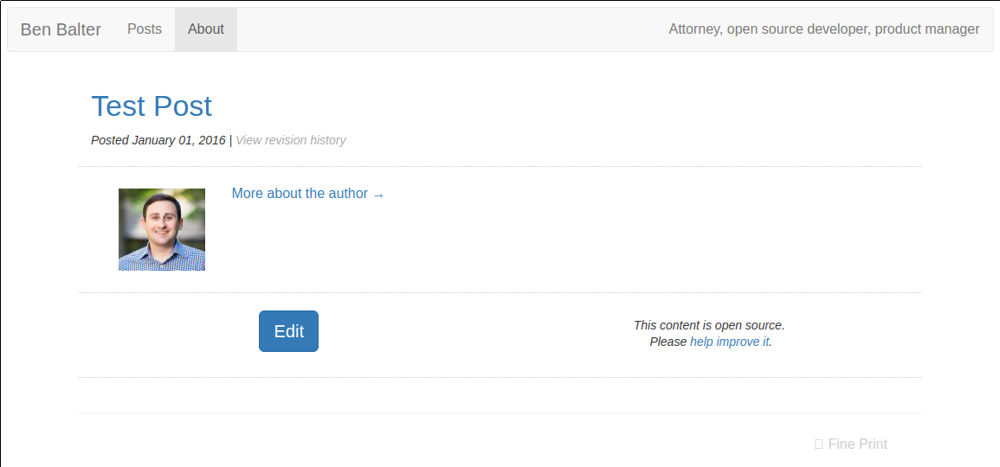

# Retlab

[](https://travis-ci.org/benbalter/retlab)



*A minimalist Jekyll theme for your personal site*


## Installation

1. Add this line to your site's configuration:

   ```yaml
   remote_theme: benbalter/retlab
   ```

2. Save a header image to `/assets/img/header.jpg`. It should be 400px by 1140px.

## Configuration

You’ll want to customize and add the following configurations to your site’s `_config.yml` file:

```yml
title: Ben Balter
description: Attorney, open source developer, product manager

lang: en-US

# Pages to include in header navigation
nav_pages:
  - index.html
  - talks.md
  - press.md
  - about.md
  - contact.md

# Pages to include in footer navigation
footer_page:
  - books.md
  - fine-print.md

# Disqus login information, for comments
disqus:
  shortname: DISQUS_USERNAME

# Links to include on the contact page
contact_links:
  - name: Twitter
    url: https://twitter.com/BenBalter
    icon: twitter
  - name: Facebook
    url: https://facebook.com/BenBalter
    icon: facebook

# Front matter defaults
defaults:
  -
    scope:
      path: ""
      type: "posts"
    values:
      layout: post
      comments: true
  -
    scope:
      path: ""
      type: "pages"
    values:
      layout: page
      comments: false

# Plugins
plugins:
  - jekyll-seo-tag
  - jekyll-avatar
  - jekyll-github-metadata
  - jekyll-feed
```

You may also want to see [Jekyll SEO Tag’s configuration](https://github.com/jekyll/jekyll-seo-tag).
