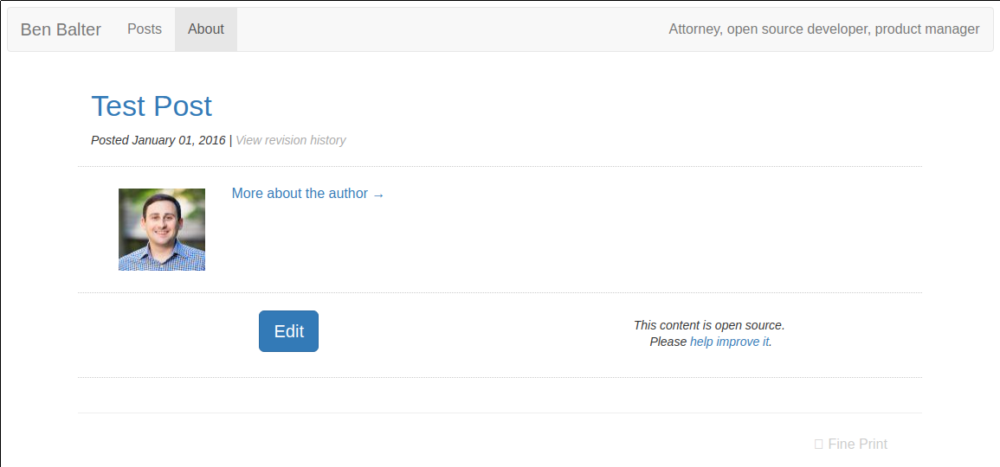

# Retlab

[](https://github.com/benbalter/retlab/actions/workflows/ci.yml)



A minimalist React-based theme for your personal site, originally built with Jekyll and now converted to React with Next.js.

## Technology Stack

- **React** - Component-based UI library
- **Next.js** - React framework with static site generation
- **TypeScript** - Type-safe JavaScript
- **Bootstrap 5** - CSS framework for responsive design
- **FontAwesome** - Icon library
- **Webpack** - Asset bundling for SCSS/CSS

## Installation

### For Development

1. Clone the repository:
   ```bash
   git clone https://github.com/benbalter/retlab.git
   cd retlab
   ```

2. Install dependencies:
   ```bash
   npm install
   ```

3. Start the development server:
   ```bash
   npm run dev
   ```

4. Open [http://localhost:3000](http://localhost:3000) in your browser

### For Production

Build the static site:
```bash
npm run build
```

The static files will be generated in the `out/` directory.

## Development Commands

- `npm run dev` - Start Next.js development server
- `npm run build` - Build assets and static site
- `npm run lint` - Run ESLint and JSONLint
- `npm run webpack` - Build SCSS/CSS assets only

## Project Structure

```
.
├── app/              # Next.js app directory (routes)
├── components/       # React components
├── lib/              # Utility functions
├── sass/             # SCSS stylesheets
├── assets/           # Built CSS/JS assets
├── public/           # Static files
└── _posts/           # Blog posts (markdown)
```

## Configuration

You’ll want to customize and add the following configurations to your site’s `_config.yml` file:

```yml
title: Ben Balter
description: Attorney, open source developer, product manager

lang: en-US

# Pages to include in header navigation
nav_pages:
  - index.html
  - talks.md
  - press.md
  - about.md
  - contact.md

# Pages to include in footer navigation
footer_pages:
  - books.md
  - fine-print.md

# Disqus login information, for comments
disqus:
  shortname: DISQUS_USERNAME

# Links to include on the contact page
contact_links:
  - name: Twitter
    url: https://twitter.com/BenBalter
    icon: twitter
  - name: Facebook
    url: https://facebook.com/BenBalter
    icon: facebook

# Front matter defaults
defaults:
  -
    scope:
      path: ""
      type: "posts"
    values:
      layout: post
      comments: true
  -
    scope:
      path: ""
      type: "pages"
    values:
      layout: page
      comments: false

# Plugins
plugins:
  - jekyll-seo-tag
  - jekyll-avatar
  - jekyll-github-metadata
  - jekyll-feed
```

You may also want to see [Jekyll SEO Tag’s configuration](https://github.com/jekyll/jekyll-seo-tag).
